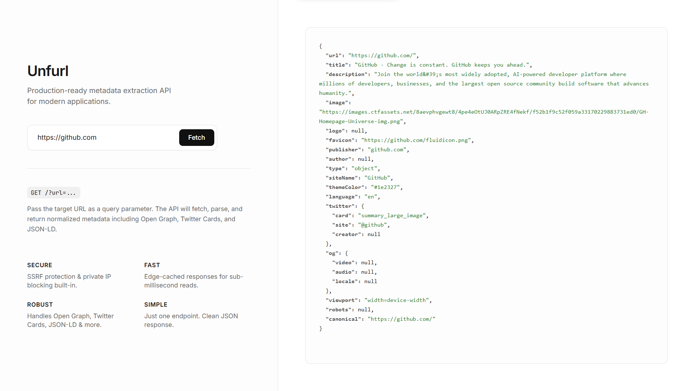

# Unfurl

> Production-ready metadata extraction API for modern applications



Unfurl is a Cloudflare Worker that extracts rich metadata from any URL. It parses Open Graph tags, Twitter Cards, JSON-LD, and standard HTML meta tags to provide normalized, structured data perfect for link previews, social sharing, and content enrichment.

## ✨ Features

- **🔒 Secure** - Built-in SSRF protection blocks access to private networks
- **⚡ Fast** - Edge-cached responses with sub-millisecond reads
- **🛡️ Robust** - Handles Open Graph, Twitter Cards, JSON-LD, and more
- **🎯 Simple** - Single endpoint with clean JSON responses
- **🎨 Beautiful UI** - Modern landing page with syntax highlighting

## 🚀 Quick Start

### Installation

1. Clone this repository:

```bash
git clone https://github.com/mosaddiqdev/unfurl.git
cd unfurl
```

2. Install Wrangler (Cloudflare's CLI):

```bash
npm install -g wrangler
```

3. Deploy to Cloudflare Workers:

```bash
npx wrangler deploy
```

## 📖 Usage

### API Endpoint

```bash
GET /?url=<target-url>
```

### Example Request

```bash
curl "https://unfurl.mosaddiqdev.workers.dev/?url=https://github.com"
```

### Example Response

```json
{
  "url": "https://github.com",
  "title": "GitHub: Let's build from here",
  "description": "GitHub is where over 100 million developers shape the future of software...",
  "image": "https://github.githubassets.com/images/modules/site/social-cards/github-social.png",
  "favicon": "https://github.githubassets.com/favicons/favicon.svg",
  "publisher": "github.com",
  "type": "website",
  "siteName": "GitHub",
  "themeColor": "#1e2327",
  "language": "en",
  "twitter": {
    "card": "summary_large_image",
    "site": "@github"
  },
  "og": {
    "locale": "en_US"
  }
}
```

### JavaScript Example

```javascript
const response = await fetch(
  "https://unfurl.mosaddiqdev.workers.dev/?url=https://example.com"
);
const metadata = await response.json();

console.log(metadata.title);
console.log(metadata.description);
console.log(metadata.image);
```

## 🎨 Landing Page

Visit the worker URL without parameters to access the interactive landing page:

```
https://unfurl.mosaddiqdev.workers.dev
```

Features:

- Live metadata extraction
- Syntax-highlighted JSON output
- Sticky copy button for easy sharing
- Auto-HTTPS for convenience

## 🔧 Configuration

Edit `wrangler.toml` to customize your deployment:

```toml
name = "unfurl"
main = "metadata-fetcher.js"
compatibility_date = "2025-11-26"
```

### Custom Domain (Optional)

```toml
routes = [
  { pattern = "api.yourdomain.com/*", zone_name = "yourdomain.com" }
]
```

## 🛡️ Security Features

- **SSRF Protection**: Blocks requests to private IP ranges (10.x.x.x, 192.168.x.x, 127.x.x.x)
- **Protocol Enforcement**: Only HTTP and HTTPS are allowed
- **Timeout Protection**: 5-second timeout prevents hanging requests
- **Size Limits**: 2MB response size cap

## 🌐 CORS Support

The API includes full CORS support, allowing cross-origin requests from any domain:

```javascript
fetch("https://unfurl.mosaddiqdev.workers.dev/?url=https://example.com")
  .then((res) => res.json())
  .then((data) => console.log(data));
```

## 📊 Response Fields

| Field         | Type   | Description                                 |
| ------------- | ------ | ------------------------------------------- |
| `url`         | string | Canonical URL of the page                   |
| `title`       | string | Page title (from OG, Twitter, or `<title>`) |
| `description` | string | Page description                            |
| `image`       | string | Primary image URL                           |
| `favicon`     | string | Favicon URL                                 |
| `logo`        | string | Apple touch icon or logo                    |
| `publisher`   | string | Domain name                                 |
| `author`      | string | Content author                              |
| `type`        | string | Open Graph type (article, website, etc.)    |
| `siteName`    | string | Site name from Open Graph                   |
| `keywords`    | array  | Keywords from meta tags (if available)      |
| `themeColor`  | string | Theme color from meta tag                   |
| `language`    | string | Page language                               |
| `twitter`     | object | Twitter Card metadata                       |
| `og`          | object | Additional Open Graph data                  |
| `canonical`   | string | Canonical URL from `<link>`                 |
| `jsonLd`      | array  | JSON-LD structured data                     |

## 🚦 Rate Limiting

For production use with high traffic, consider enabling Cloudflare's Rate Limiting:

1. Go to your Cloudflare Dashboard
2. Navigate to Security → WAF
3. Create a rate limiting rule for your worker

## 📝 License

MIT License - feel free to use this in your projects!

## 🤝 Contributing

Contributions are welcome! Feel free to:

- Report bugs
- Suggest features
- Submit pull requests

## 👤 Author

Built with ❤️ by [mosaddiqdev](https://github.com/mosaddiqdev)

## 🙏 Acknowledgments

- Powered by [Cloudflare Workers](https://workers.cloudflare.com/)
- Inspired by modern metadata extraction needs

---

**Live Demo**: [https://unfurl.mosaddiqdev.workers.dev](https://unfurl.mosaddiqdev.workers.dev)
